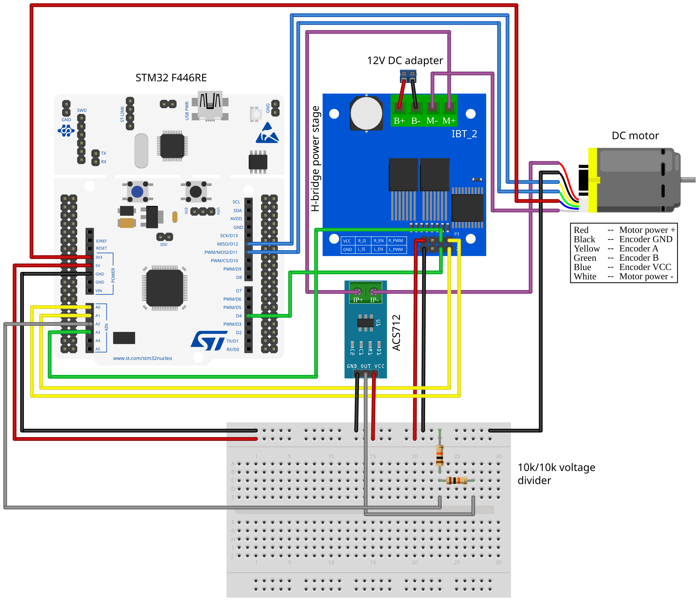
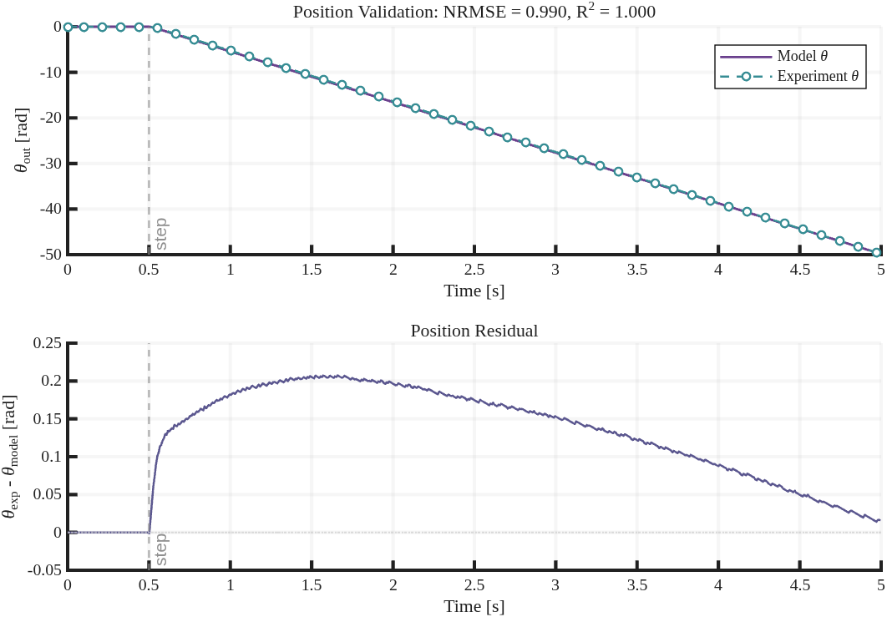

# DC Motor Control Test Rig

An open-source experimental test rig for DC motor characterization and embedded control. The rig will support reproducible experiments from basic motor modeling to advanced control design.

Detailed methods, equations, parameter values, and validation results are maintained in a companion technical report (forthcoming as `TECHNICAL_REPORT.md`).

## Repository Layout

```text
hardware/       Hardware datasheets, wiring diagram, and rig photos
firmware/       STM32 firmware, generated embedded code, board-level configuration
matlab/         MATLAB scripts/Simulink models for identification, validation, control
data/           Raw and processed experiment data used to reproduce plots/metrics
results/        Generated figures, validation plots, control outputs
docs/           Build notes, operating instructions, safety notes, method explanations
images/         README-facing images such as labeled photos and wiring diagrams
```

## Roadmap
- [x] Hardware rig assembled and wired
- [x] Open-loop position-based model validation
- [ ] PID control
- [ ] State-space control + observer + advanced control algorithms

## Hardware / Test Rig

- STM32 Nucleo-F446RE microcontroller board
- 12 V DC geared motor with quadrature encoder, JGA25-371 class
- IBT-2 / BTS7960 H-bridge motor driver
- ACS712 5 A current sensor
- 12 V DC power supply

<p align="left">
  
</p>

## Wiring Diagram

<p align="left">
  
</p>

## Motor Identification and Model Validation

Motor parameters were identified by classical lumped-element methods: `R_a` from locked-rotor current; `K` and `b` from steady-state voltage–speed and torque–speed measurements; `J` from a coast-down test.

| Parameter | Value | Note |
|---|---:|---|
| `Ra` | 2.1 ohm | Armature resistance |
| `La` | 100 uH | Armature inductance (assumed for now) |
| `K` | 0.59 V s/rad | Back-EMF / torque constant (output-shaft referred) |
| `J` | 2.03e-3 kg m^2 | Equivalent inertia (output-shaft referred) |
| `b` | 0.0164 N m s/rad | Viscous friction (output-shaft referred) |

Using these parameters, the model closely matches the measured position response for the voltage-step validation test (`NRMSE = 0.990`, `R^2 = 1.000`).

<p align="left">
  
</p>


## Citation

If you use this project or build on the test rig design, please cite:

```bibtex
@misc{ahmed2026dcmotorcontroltestrig,
  title        = {DC Motor Control Test Rig},
  author       = {Ahmed, Kazi Sher},
  year         = {2026},
  howpublished = {\url{https://github.com/Kazi-Sher/DC-Motor-Control-Testrig}},
  note         = {Open-source hardware and control test rig}
}
```
