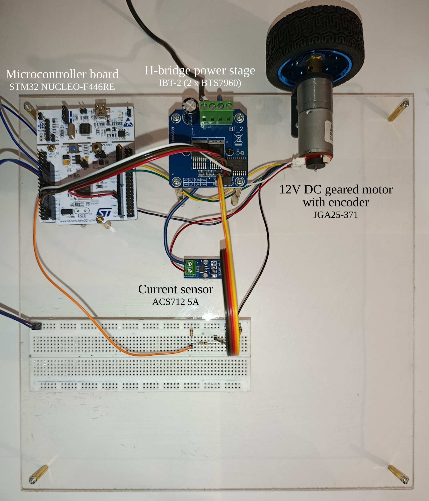

# DC Motor Control Test Rig

## Overview
A compact experimental platform for embedded motor control using an STM32 Nucleo-F446RE, BTS7960 (IBT-2) H-bridge, quadrature encoder feedback, and ACS712 current sensing.

## Hardware
- STM32 Nucleo-F446RE
- 12 V DC geared motor with quadrature encoder (JGA25-371)
- IBT-2 / BTS7960 H-bridge
- ACS712 5 A current sensor
- 12 V DC supply

## Setup

  

  

