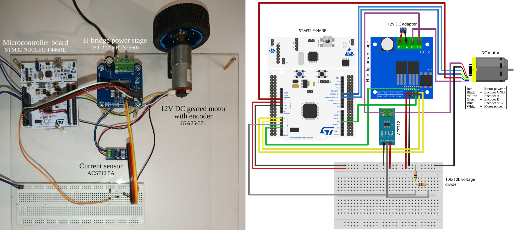
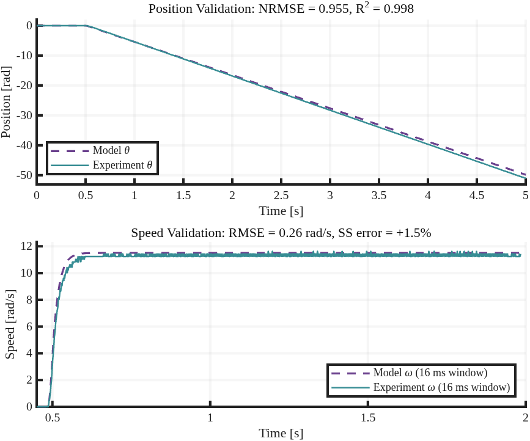
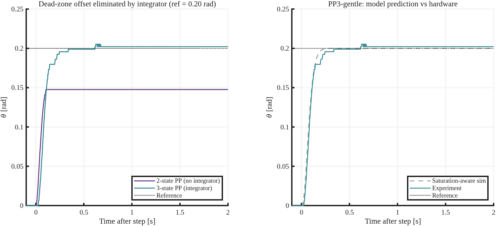
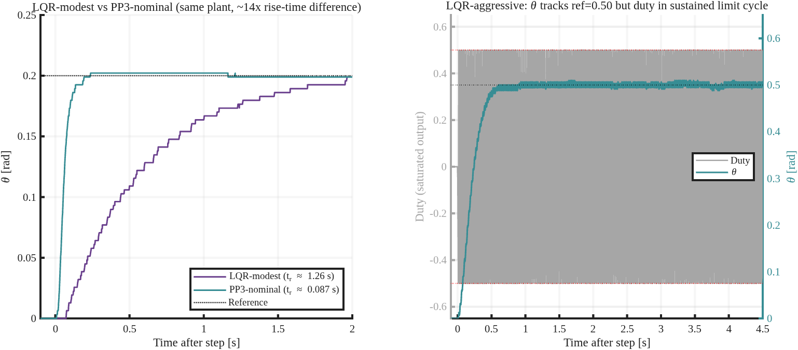

# DC Motor Control Test Rig

An open-source experimental test rig for DC motor characterization and embedded control. The rig will support reproducible experiments from basic motor modeling to advanced control design.

Detailed methods, equations, parameter values, and validation results are maintained in a companion technical report (forthcoming as `TECHNICAL_REPORT.md`).

## Repository Layout

```text
hardware/       Hardware datasheets, wiring diagram, and rig photos
firmware/       STM32 firmware, generated embedded code, board-level configuration
matlab/         MATLAB scripts/Simulink models for identification, validation, control
data/           Raw and processed experiment data used to reproduce plots/metrics
results/        Generated figures, validation plots, control outputs
docs/           Build notes, operating instructions, safety notes, method explanations
images/         README-facing images such as labeled photos and wiring diagrams
```

## Roadmap
- [x] Hardware rig assembled
- [x] Position and speed based model validation
- [x] PI speed control
- [x] State-space control (pole placement + LQR)

## Test Rig

- STM32 Nucleo-F446RE microcontroller board
- 12 V DC geared motor with quadrature encoder, JGA25-371 class
- IBT-2 / BTS7960 H-bridge motor driver
- ACS712 5 A current sensor
- 12 V DC power supply

<p align="center">
  
</p>

## Motor Identification and Model Validation

Motor parameters were identified by classical lumped-element methods: `R_a` from locked-rotor current; `K` and `b` from steady-state voltage–speed and torque–speed measurements; `J` from a coast-down test.

| Parameter | Value | Note |
|---|---:|---|
| `Ra` | 2.1 Ω | Armature resistance |
| `La` | 100 µH | Armature inductance (assumed for now) |
| `K` | 0.59 V s/rad | Back-EMF / torque constant (output-shaft referred) |
| `J` | 2.03e-3 kg m² | Equivalent inertia (output-shaft referred) |
| `b` | 0.0164 N m s/rad | Viscous friction (output-shaft referred) |

Using these parameters, the model closely matches the measured position response for the voltage-step validation test (`NRMSE = 0.955`, `R^2 = 0.998`).

<p align="center">
  
</p>

The motor was further characterized using an open-loop duty staircase. The identified model was then validated on a separate single-step experiment: a `0.6` duty command applied at `t = 0.5 s`. The model predicts the measured speed response closely:

- RMSE over the step response: `0.26 rad/s`
- Steady-state speed error: `+1.5%`
- Speed estimate: encoder position forward difference with 16 ms window


## PI Speed Control

PI speed control was designed using the experimentally identified first-order speed model of motor:

$$
G(s)=\frac{K_{dc}}{\tau s+1}
$$

where $K_{dc} = 19.524~\text{rad/s/duty}$ and $\tau=0.018~\text{s}$. The controller gains were selected by matching the closed-loop denominator to a second-order target with $\omega_n=50~\text{rad/s}$ and $\zeta=0.9$, giving $K_p = 0.0318$ and $K_i = 2.3049$.

The figure below compares the saturation-aware simulation with the real motor-rig response for a $10~\text{rad/s}$ speed step. The raw embedded speed estimate is shown for transparency, but performance metrics are computed from a 50 ms angle-slope estimate to reduce encoder quantization effects.

Angle-derived experimental metrics:

- Peak speed: $10.51~\text{rad/s}$
- Overshoot: 5.1%
- Rise time: $44~\text{ms}$
- Settling time (2%): $127~\text{ms}$
- Steady-state error: Approx. $3.5e-4~\text{rad/s}$

<p align="center">
  
</p>


## State-Space Position Control

The PI speed plant was extended to a 2-state position model `x = [θ, ω]ᵀ` and a 3-state form `x_aug = [x_i, θ, ω]ᵀ` with an integrator on the tracking error. Three controller families were designed and deployed with references of 0.20 rad and 0.50 rad:

1. **2-state pole placement (PP2):** `K = [K_θ, K_ω]` plus feedforward `Nbar`
2. **3-state pole placement with integrator (PP3):** `K_aug = [K_i, K_θ, K_ω]`, no `Nbar` since the integrator handles DC tracking
3. **LQR** on the same 3-state plant: gains from `lqr(A_aug, B_aug, Q, R)`

### Pole placement (PP): dead-zone discovery and integrator fix

Without the integrator, the controller stalls before reaching the reference because the residual duty falls below the motor's static-friction threshold. Adding an integrator state eliminates this offset and the saturation-aware simulation tracks the 3-state hardware response within the noise floor.

<p align="center">
  
</p>

Results (reference = 0.20 rad):

- **2-state PP-gentle:** steady-state offset ≈ **26 %** (motor stalls at 0.148 rad)
- **3-state PP-gentle:** steady-state offset ≈ **1 %** (reaches 0.20 rad)
- **Cross-validated motor breakaway threshold:** ≈ **6 % PWM duty**, from residual steady-state command across four PP2 runs
- **Model vs hardware (PP3-gentle):** steady-state match within encoder resolution

### LQR: methodology comparison and a limit-cycle finding

LQR on the same plant chooses gains by minimizing a quadratic cost rather than placing specific poles. Conservative weights produce a clean, low-jitter response but at much lower bandwidth than the equivalent pole-placement design. Aggressive weights raise the bandwidth. But on hardware, the closed loop falls into a sustained limit cycle: position still tracks the reference, but the control effort thrashes between duty saturation rails.

<p align="center">
  
</p>

Results:

- **LQR-modest (ref 0.20 rad):** 10–90 rise time ≈ **1.26 s** vs PP3-nominal's **0.087 s** with comparable steady-state accuracy but ~14× slower bandwidth.
- **LQR-aggressive (ref 0.50 rad):** position σ over last 1 s ≈ **5 mrad**, but duty σ ≈ **0.47** with peaks at the ±0.50 saturation rails; peak current ≈ **4.4 A**. Linear-optimal design failed to anticipate the interaction of encoder quantization, motor dead-zone, and speed-estimator lag at high bandwidth.


## Citation

If you use this project or build on the test rig design, please cite:

```bibtex
@misc{ahmed2026dcmotorcontroltestrig,
  title        = {DC Motor Control Test Rig},
  author       = {Ahmed, Kazi Sher},
  year         = {2026},
  howpublished = {\url{https://github.com/Kazi-Sher/DC-Motor-Control-Testrig}},
  note         = {Open-source hardware and control test rig}
}
```
