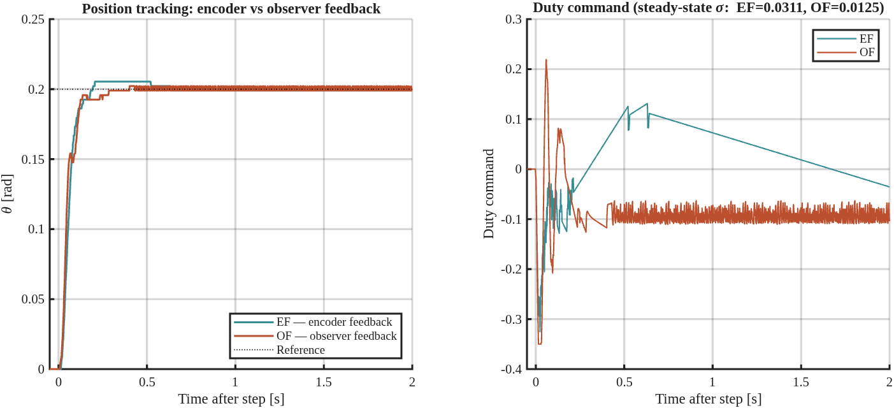
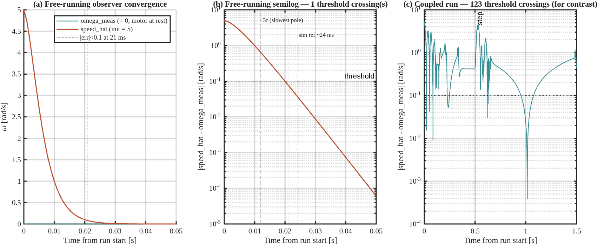
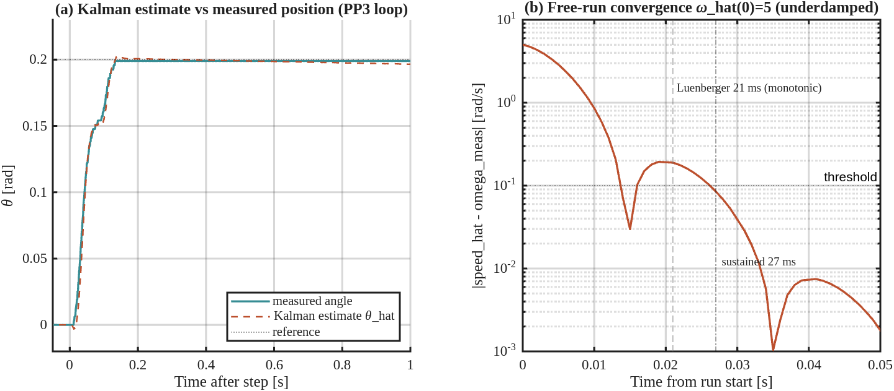
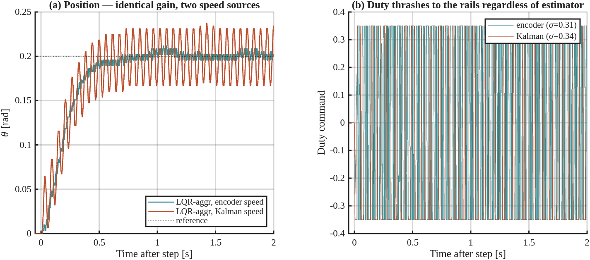
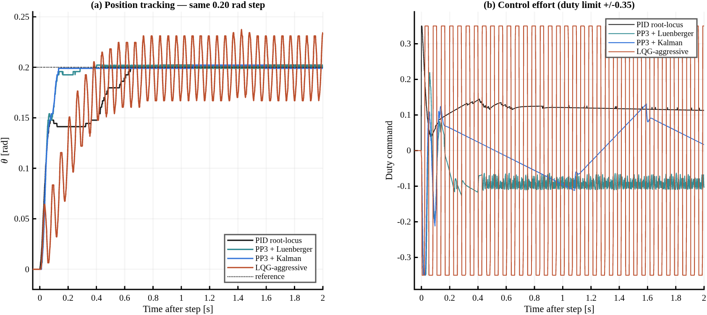

# DC Motor Control Test Rig

An open-source experimental test rig for DC motor characterization and embedded control. The rig will support reproducible experiments from basic motor modeling to advanced control design.

Detailed methods, equations, parameter values, and validation results are maintained in a companion technical report (forthcoming as `TECHNICAL_REPORT.md`).

## Repository Layout

```text
hardware/       Hardware datasheets, wiring diagram, and rig photos
firmware/       STM32 firmware, generated embedded code, board-level configuration
matlab/         MATLAB scripts/Simulink models for identification, validation, control
data/           Raw and processed experiment data used to reproduce plots/metrics
results/        Generated figures, validation plots, control outputs
docs/           Build notes, operating instructions, safety notes, method explanations
images/         README-facing images such as labeled photos and wiring diagrams
```

## Roadmap
- [x] Hardware rig assembled
- [x] Position and speed based model validation
- [x] PI speed control
- [x] State-space position control (pole placement + LQR)
- [x] Observer-based estimation (Luenberger + Kalman / LQG)
- [x] Multi-controller benchmark (PID, pole placement, LQR, observer-based)

## Test Rig

- STM32 Nucleo-F446RE microcontroller board
- 12 V DC geared motor with quadrature encoder, JGA25-371 class
- IBT-2 / BTS7960 H-bridge motor driver
- ACS712 5 A current sensor
- 12 V DC power supply

<p align="center">
  
</p>

## Motor Identification and Model Validation

Motor parameters were identified by classical lumped-element methods: `R_a` from locked-rotor current; `K` and `b` from steady-state voltage–speed and torque–speed measurements; `J` from a coast-down test.

| Parameter | Value | Note |
|---|---:|---|
| `Ra` | 2.1 Ω | Armature resistance |
| `La` | 100 µH | Armature inductance (assumed for now) |
| `K` | 0.59 V s/rad | Back-EMF / torque constant (output-shaft referred) |
| `J` | 2.03e-3 kg m² | Equivalent inertia (output-shaft referred) |
| `b` | 0.0164 N m s/rad | Viscous friction (output-shaft referred) |

Using these parameters, the model closely matches the measured position response for the voltage-step validation test (`NRMSE = 0.955`, `R^2 = 0.998`).

<p align="center">
  
</p>

The motor was further characterized using an open-loop duty staircase. The identified model was then validated on a separate single-step experiment: a `0.6` duty command applied at `t = 0.5 s`. The model predicts the measured speed response closely:

- RMSE over the step response: `0.26 rad/s`
- Steady-state speed error: `+1.5%`
- Speed estimate: encoder position forward difference with 16 ms window


## PI Speed Control

PI speed control was designed using the experimentally identified first-order speed model of motor:

$$
G(s)=\frac{K_{dc}}{\tau s+1}
$$

where $K_{dc} = 19.524~\text{rad/s/duty}$ and $\tau=0.018~\text{s}$. The controller gains were selected by matching the closed-loop denominator to a second-order target with $\omega_n=50~\text{rad/s}$ and $\zeta=0.9$, giving $K_p = 0.0318$ and $K_i = 2.3049$.

The figure below compares the saturation-aware simulation with the real motor-rig response for a $10~\text{rad/s}$ speed step. The raw embedded speed estimate is shown for transparency, but performance metrics are computed from a 50 ms angle-slope estimate to reduce encoder quantization effects.

Angle-derived experimental metrics:

- Peak speed: $10.51~\text{rad/s}$
- Overshoot: 5.1%
- Rise time: $44~\text{ms}$
- Settling time (2%): $127~\text{ms}$
- Steady-state error: Approx. $3.5e-4~\text{rad/s}$

<p align="center">
  
</p>


## State-Space Position Control

The PI speed plant was extended to a 2-state position model `x = [θ, ω]ᵀ` and a 3-state form `x_aug = [x_i, θ, ω]ᵀ` with an integrator on the tracking error. Three controller families were designed and deployed with references of 0.20 rad and 0.50 rad:

1. **2-state pole placement (PP2):** `K = [K_θ, K_ω]` plus feedforward `Nbar`
2. **3-state pole placement with integrator (PP3):** `K_aug = [K_i, K_θ, K_ω]`, no `Nbar` since the integrator handles DC tracking
3. **LQR** on the same 3-state plant: gains from `lqr(A_aug, B_aug, Q, R)`

### Pole placement (PP): dead-zone discovery and integrator fix

Without the integrator, the controller stalls before reaching the reference because the residual duty falls below the motor's static-friction threshold. Adding an integrator state eliminates this offset and the saturation-aware simulation tracks the 3-state hardware response within the noise floor.

<p align="center">
  
</p>

Results (reference = 0.20 rad):

- **2-state PP-gentle:** steady-state offset ≈ **26 %** (motor stalls at 0.148 rad)
- **3-state PP-gentle:** steady-state offset ≈ **1 %** (reaches 0.20 rad)
- **Cross-validated motor breakaway threshold:** ≈ **6 % PWM duty**, from residual steady-state command across four PP2 runs
- **Model vs hardware (PP3-gentle):** steady-state match within encoder resolution

### LQR: methodology comparison and a limit-cycle finding

LQR on the same plant chooses gains by minimizing a quadratic cost rather than placing specific poles. Conservative weights produce a clean, low-jitter response but at much lower bandwidth than the equivalent pole-placement design. Aggressive weights raise the bandwidth. But on hardware, the closed loop falls into a sustained limit cycle: position still tracks the reference, but the control effort thrashes between duty saturation rails.

<p align="center">
  
</p>

Results:

- **LQR-modest (ref 0.20 rad):** 10–90 rise time ≈ **1.26 s** vs PP3-nominal's **0.087 s** with comparable steady-state accuracy but ~14× slower bandwidth.
- **LQR-aggressive (ref 0.50 rad):** position σ over last 1 s ≈ **5 mrad**, but duty σ ≈ **0.47** with peaks at the ±0.50 saturation rails; peak current ≈ **4.4 A**. The linear-optimal design did not account for encoder quantization, motor dead-zone, duty saturation, and high feedback gains interacting on real hardware.


### Luenberger observer: model-based speed feedback

A discrete Luenberger observer was added to the 3-state pole-placement position controller. The observer estimates `x = [theta, omega]^T` from commanded duty and encoder position; it does not differentiate the encoder signal for speed. The controller gains are unchanged from the PP3-nominal design (`K = [-103.7, 6.04, 0.073]`); only the speed-feedback source is switched between the filtered encoder derivative (`omega_meas`) and observer estimate (`speed_hat`).

<p align="center">
  
</p>

Results for a `0.20 rad` position step:

- **Observer feedback:** mean steady-state position `0.20000 rad` vs `0.1990 rad` with encoder-speed feedback; both are sub-encoder-count errors, but observer feedback brings the mean error close to zero.
- **Overshoot:** `1.1%` with observer feedback vs `2.7%` with encoder-speed feedback.
- **Rise time:** `92 ms` with observer feedback vs `83 ms` with encoder-speed feedback.
- **Duty ripple:** steady-state duty σ drops from `0.031` to `0.013`; duty peak-to-peak drops from `0.111` to `0.047`.
- **Trade-off:** steady-state position σ rises from `0.15 mrad` to `1.50 mrad`, while peak-to-peak position motion remains bounded to one encoder quantum (`3.21 mrad`).

The observer was also tested with an intentionally incorrect initial speed estimate, `omega_hat(0) = 5 rad/s`.

<p align="center">
  
</p>

Convergence results:

- **Decoupled observer test:** encoder feedback remains in control, `ref = 0`, and the motor stays at rest. The observer estimate converges below `0.1 rad/s` in `21 ms` with a single threshold crossing.
- **Coupled observer-in-loop test:** the same incorrect initial estimate is fed to the controller. The controller initially saturates duty and moves the motor, but the closed loop remains stable and recovers to track the reference.

This demonstrates both the estimator's standalone initial-condition recovery and the closed loop's tolerance of observer-state mismatch.


### Kalman estimator (LQG): optimal estimation and a limit-cycle test

The observer architecture was kept identical and only the gain was redesigned: the pole-placement gain `L` was replaced by a steady-state Kalman gain. The measurement-noise covariance `R` is set from encoder quantization (`q²/12`, `q = 3.21 mrad`); the process-noise covariance `Q` is tuned for comparable estimator bandwidth. Paired with the LQR controller, this gives the LQG test case.

<p align="center">
  
</p>

Estimator results (`0.20 rad` step, Kalman estimate feeding the PP3 loop):

- **Tracking:** sub-encoder-count steady-state error and `1.1%` overshoot — on par with the Luenberger result, confirming the Kalman estimator deploys correctly on hardware.
- **Free-run convergence:** with a deliberately wrong initial speed (`omega_hat(0) = 5 rad/s`), controller decoupled, and motor at rest, the Kalman estimate is underdamped. It first crosses `0.1 rad/s` at `14 ms`, then sustains below threshold from `27 ms`; the Luenberger observer was monotonic and reached the same sustained threshold in `21 ms`.

A second test asked whether a cleaner speed estimate could cure the LQR limit cycle found above. The **identical** LQR-aggressive gain was run with the speed feedback switched between the encoder derivative and the Kalman estimate — one signal changed, nothing else (reference `0.20 rad`, duty limit `±0.35`).

<p align="center">
  
</p>

Limit-cycle test results:

- The limit cycle **persists with both speed sources**: the duty command thrashes between the `±0.35` saturation rails (steady-state duty `σ ≈ 0.31` with encoder, `0.34` with Kalman) and neither case settles.
- The Kalman estimate **did not suppress** the limit cycle — it amplified the position oscillation (overshoot `5.9% → 18.7%`, peak current `2.85 A → 3.33 A`).
- **Conclusion:** these runs strongly suggest the limit cycle is actuator/dead-zone/saturation driven, not primarily speed-estimate-noise driven. The LQR speed gain `K_ω` is 4–13× the pole-placement value, so replacing the speed estimate alone is not enough; pole placement with observer feedback remains the clean deployable design on this rig.


## Multi-Controller Benchmark

Four controller entries were run on the **identical** `0.20 rad` step at the same `±0.35` duty limit, spanning the classical → modern → optimal progression: PID, pole placement with observer feedback (Luenberger and Kalman), and aggressive LQG.

<p align="center">
  
</p>

| Controller | Rise `t_r` | Overshoot | Settling `t_s` | `e_ss` | Duty `σ` | Effort `∫u²` | `I_peak` |
|---|---:|---:|---:|---:|---:|---:|---:|
| PID (classical) | 550 ms | 1.1 % | 641 ms | −1.1 mrad | 0.003 | 0.06 | 1.94 A |
| PP3 + Luenberger | 92 ms | 1.1 % | 284 ms | 0.01 mrad | 0.013 | 0.04 | 1.65 A |
| PP3 + Kalman (LQG est.) | 90 ms | 1.1 % | 132 ms | 0.26 mrad | 0.028 | 0.02 | 1.97 A |
| LQG-aggressive (optimal-control gain + Kalman) | 299 ms | 18.7 % | — * | −0.35 mrad | 0.342 | 0.53 | 3.33 A |

<sub>* never settles within `±2%`: sustained limit cycle. Steady-state stats over the final 1 s; encoder quantum = 3.21 mrad.</sub>

- **PID** tracks cleanly to sub-quantum error but is ~6× slower, climbing in a visible dead-zone staircase, at the lowest control effort.
- **Pole placement with observer feedback** is the best overall design: ~`90 ms` rise, sub-quantum steady-state error, and the lowest control effort. The observer choice is a minor trade — Luenberger settles with lower duty `σ`, Kalman settles fastest.
- **LQG-aggressive** overshoots and never settles; the dead-zone/saturation limit cycle dominates at ~10–17× the control effort and ~2× the peak current of the observer-based designs.

The headline result: on this rig, **modern observer-based pole placement is the deployable winner.** Better state *estimation* (Luenberger → Kalman) improves the feedback signal, but textbook-optimal *control* (LQR) requires explicit dead-zone / anti-windup handling before it is usable — a practical lesson that only the hardware experiment reveals.


## Citation

If you use this project or build on the test rig design, please cite:

```bibtex
@misc{ahmed2026dcmotorcontroltestrig,
  title        = {DC Motor Control Test Rig},
  author       = {Ahmed, Kazi Sher},
  year         = {2026},
  howpublished = {\url{https://github.com/Kazi-Sher/DC-Motor-Control-Testrig}},
  note         = {Open-source hardware and control test rig}
}
```
